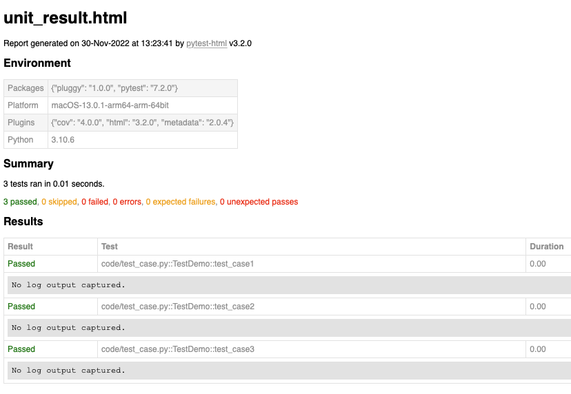
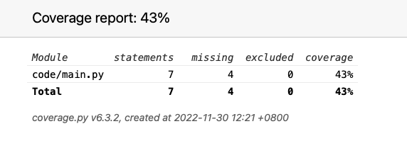
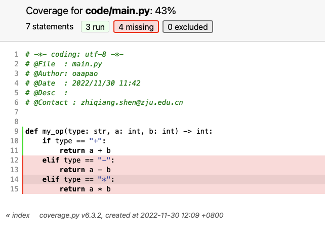

# SoftwareTest

SoftwareTest Course

## Install

```shell
pip install -r requirements.txt
```

## Code your program

edit `code/main.py`

## Design test case

edit `code/test_case.py`

## Run test

```shell
python run_cover.py

python run_case.py
```

## Test Result

Unit test result has been saved to `unit_result.html`.


Coverage result has been saved to `htmlcov/index.html`.


For code level, result can be found in another `html` file.
